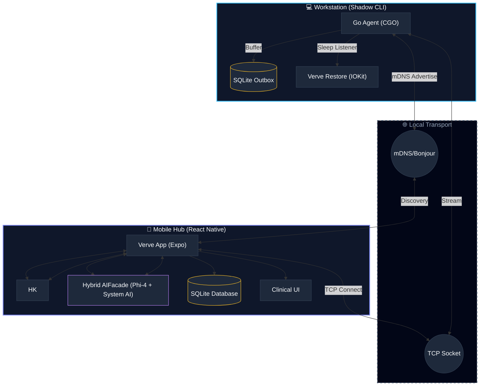

# Verve: Premium Telemetry & Cognitive Insights

<p align="center">
  
</p>

<p align="center">
  <a href="https://reactnative.dev/"></a>
  <a href="https://go.dev/"></a>
  <a href="https://expo.dev/"></a>
  <a href="https://www.typescriptlang.org/"></a>
</p>

---

## 🧬 Why "Verve"?

**Verve** is often used to describe vitality and spirit, but in a biological context, it relates to the **nervous energy** that triggers the heart.

As a project focused on quantifying cognitive load through heart rate and physiological signals, the name perfectly encapsulates the intersection of biological vitality and digital performance. It's concise, high-end, and reflects the premium nature of the application.

---

## ✨ Key Features

| Feature              | Description                                                     | Icon |
| :------------------- | :-------------------------------------------------------------- | :--: |
| **Secure Handshake** | 6-digit PIN pairing & session token persistence for security.   |  🔐  |
| **Clinical Stats**   | Multi-dimensional analytics using SQLite JSON processing.       |  📊  |
| **Hybrid AI**        | AIFacade orchestrates Phi-4 & System AI (Gemini/CoreML).        |  🧠  |
| **Verve Restore**    | IOKit-triggered data flush before device sleep to prevent loss. |  🛡️  |
| **mDNS Discovery**   | Dynamic CLI naming; VPN-resilient physical interface binding.   |  🛰️  |

---

## 🏗️ Architecture



---

## 🚀 Quick Start

### 1. Environment Setup

Verve requires specific versions of Go and Node.js for stability.

#### 🍏 macOS (Recommended)

```bash
# 1. Install Node.js 24 using nvm
nvm install 24 && nvm use 24

# 2. Install Go 1.26+
brew install go

# 3. Verify installations
node -v # Should be v24.x
go version # Should be 1.26+
```

> [!TIP]
> If you're using **nvm**, this project includes an `.nvmrc` file. Just run `nvm use` in the root directory.

#### 📦 Project Initialization

Once your environment is ready, initialize the project with a single command:

```bash
# Install all mobile dependencies and tidy Go modules
make setup
```

### 2. Launching the Stack

Verve uses a root `Makefile` to simplify orchestration. Launch each component in its own terminal tab:

| Component       | Command        | Purpose                       |
| :-------------- | :------------- | :---------------------------- |
| **Shadow CLI**  | `make run`     | Build and launch telemetry    |
| **Mobile Hub**  | `make ios`     | Launch iOS app (Native Build) |
| **Android Hub** | `make android` | Launch Android app (Native)   |
| **Metro Hub**   | `make start`   | Start Expo dev server         |
| **Help Hub**    | `make help`    | Show all available commands   |

---

## 🛠️ Technology Stack

- **CLI/Backend**: [Go](https://go.dev/) (CGO, Zeroconf, TCP Server)
- **Mobile Frontend**: [React Native](https://reactnative.dev/) with [Expo Router](https://docs.expo.dev/router/introduction/)
- **State & Storage**: [SQLite](https://www.sqlite.org/) for local-first data persistence
- **Communication:** [mDNS/Zeroconf](https://en.wikipedia.org/wiki/Zero-configuration_networking) (with VPN-resilient binding) & [Direct TCP Client](https://en.wikipedia.org/wiki/Transmission_Control_Protocol)

---

## 📜 License

This project is licensed under the **Apache License 2.0**.

See the [LICENSE](LICENSE) file for the full legal text.
