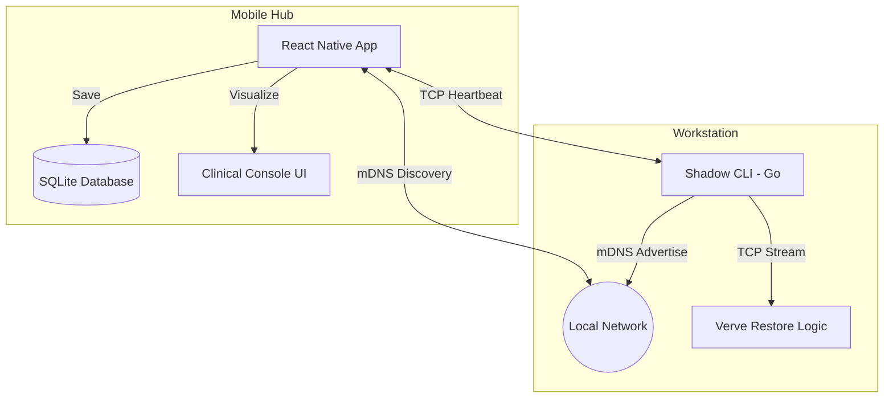

# Verve: Premium Telemetry & Cognitive Insights

<p align="center">
  
</p>

<p align="center">
  <a href="https://reactnative.dev/"></a>
  <a href="https://go.dev/"></a>
  <a href="https://expo.dev/"></a>
  <a href="https://www.typescriptlang.org/"></a>
</p>

---

## 🧬 Why "Verve"?

**Verve** is often used to describe vitality and spirit, but in a biological context, it relates to the **nervous energy** that triggers the heart.

As a project focused on quantifying cognitive load through heart rate and physiological signals, the name perfectly encapsulates the intersection of biological vitality and digital performance. It's concise, high-end, and reflects the premium nature of the application.

---

## ✨ Key Features

| Feature                 | Description                                                   | Icon |
| :---------------------- | :------------------------------------------------------------ | :--: |
| **mDNS Discovery**      | Seamless local network auto-discovery between CLI & App.      |  🛰️  |
| **TCP Stream**          | Real-time telemetry streaming with persistent heartbeat.      |  💓  |
| **Shadow CLI**          | Lightweight Go-based agent running CGO for low-level metrics. |  🖥️  |
| **Restore Mode**        | Intelligent data flush before laptop sleep to prevent loss.   |  🛡️  |
| **Cognitive Analytics** | Advanced focus scoring using biometrics (HRV/BPM).            |  🧠  |

---

## 🏗️ Architecture



---

## 🚀 Quick Start

### 1. Environment Setup

Ensure you have **Go** (~1.22) and **Node.js** (LTS) installed.

```bash
# Install mobile dependencies
npm install
```

### 2. Launching the Stack

Verve uses a root `Makefile` to simplify orchestration.

| Component      | Command      | Purpose                      |
| :------------- | :----------- | :--------------------------- |
| **Project**    | `make help`  | Show all available commands  |
| **Shadow CLI** | `make run`   | Launch the telemetry service |
| **Mobile Hub** | `make ios`   | Launch the iOS client        |
| **Metro Hub**  | `make start` | Start the Expo dev server    |

---

## 🛠️ Technology Stack

- **CLI/Backend**: [Go](https://go.dev/) (CGO, Zeroconf, TCP)
- **Mobile Frontend**: [React Native](https://reactnative.dev/) with [Expo Router](https://docs.expo.dev/router/introduction/)
- **State & Storage**: [SQLite](https://www.sqlite.org/) for local-first data persistence
- **Communication**: [mDNS/Zeroconf](https://en.wikipedia.org/wiki/Zero-configuration_networking) & [TCP Sockets](https://en.wikipedia.org/wiki/Transmission_Control_Protocol)

---
