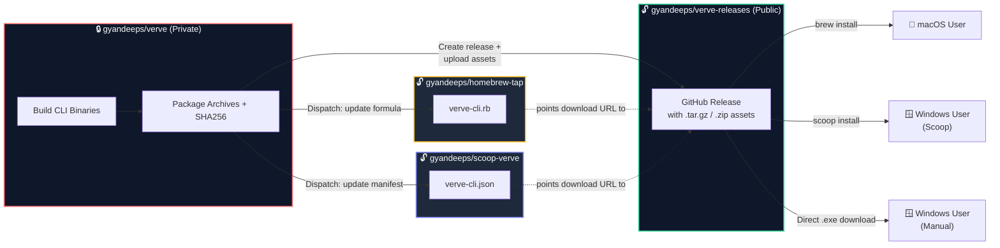
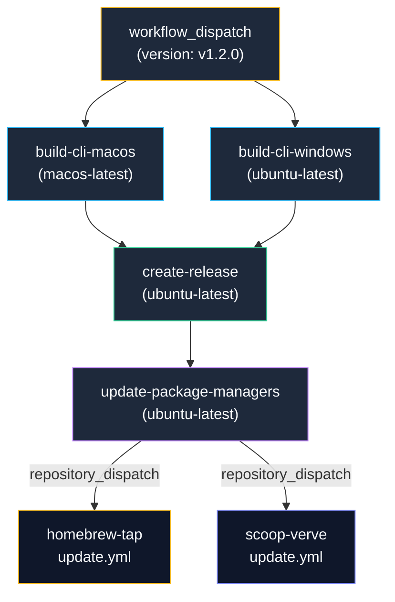
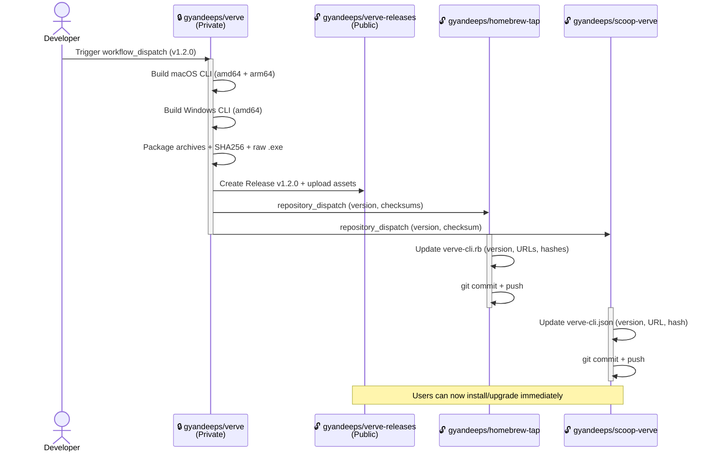

# Verve CLI Release Architecture

## 1. Overview

The Verve CLI release system follows a **private-source, public-distribution** model. Source code lives in a private repository, while compiled binaries are published to a public repository for frictionless installation via native package managers. Mobile app builds are handled separately via **EAS Build** and are not part of this pipeline.



## 2. Repository Map

| Repository                 | Visibility | Role                  | Contents                                              |
| :------------------------- | :--------- | :-------------------- | :---------------------------------------------------- |
| `gyandeeps/verve`          | 🔒 Private | Source of truth       | Go source, React Native app, CI/CD workflows, docs    |
| `gyandeeps/verve-releases` | 🔓 Public  | Binary distribution   | GitHub Releases with `.tar.gz`, `.zip`, `.exe` assets |
| `gyandeeps/homebrew-tap`   | 🔓 Public  | macOS package index   | `Formula/verve-cli.rb` + auto-update workflow         |
| `gyandeeps/scoop-verve`    | 🔓 Public  | Windows package index | `bucket/verve-cli.json` + auto-update workflow        |

## 3. Release Artifacts

Each release produces the following artifacts, all attached to a single GitHub Release on `verve-releases`:

| Artifact                        | Platform | Arch          | Format   | Distribution Channel   |
| :------------------------------ | :------- | :------------ | :------- | :--------------------- |
| `verve-cli-darwin-amd64.tar.gz` | macOS    | Intel         | tar.gz   | Homebrew               |
| `verve-cli-darwin-arm64.tar.gz` | macOS    | Apple Silicon | tar.gz   | Homebrew               |
| `verve-cli-windows-amd64.zip`   | Windows  | x64           | zip      | Scoop                  |
| `verve-cli-windows-amd64.exe`   | Windows  | x64           | exe      | Direct download        |
| `*.sha256`                      | —        | —             | checksum | Integrity verification |

## 4. Distribution Channels

### 4.1 macOS — Homebrew (Custom Tap)

```bash
brew install gyandeeps/tap/verve-cli        # Install
brew services start verve-cli                # Run as background daemon
brew upgrade verve-cli                       # Upgrade to latest
```

- **Tap repo:** `gyandeeps/homebrew-tap` → tap name `gyandeeps/tap`
- **Formula:** `Formula/verve-cli.rb` with architecture-specific `url` and `sha256`
- **Service support:** Homebrew `service` block enables `brew services start/stop` for auto-start on boot

### 4.2 Windows — Scoop (Custom Bucket)

```powershell
scoop bucket add verve https://github.com/gyandeeps/scoop-verve
scoop install verve-cli                      # Install
scoop update verve-cli                       # Upgrade to latest
```

- **Bucket repo:** `gyandeeps/scoop-verve`
- **Manifest:** `bucket/verve-cli.json` with `checkver` + `autoupdate` for self-updating

### 4.3 Windows — Direct Download

```
https://github.com/gyandeeps/verve-releases/releases/latest
```

The standalone `verve-cli-windows-amd64.exe` is attached to every release. No package manager required — download and run.

## 5. CI/CD Pipeline

### 5.1 Workflow: `Release Verve CLI`

- **Trigger:** Manual `workflow_dispatch` with optional version tag (e.g., `v1.2.0`)
- **Location:** `.github/workflows/release.yml` in `gyandeeps/verve`
- **Scope:** CLI builds only. Mobile builds are handled via EAS Build.

### 5.2 Job Dependency Graph



### 5.3 Pipeline Steps

| Step | Job                       | Action                                                                |
| :--- | :------------------------ | :-------------------------------------------------------------------- |
| 1    | `build-cli-macos`         | Compile Go binaries (amd64 + arm64) with `-ldflags` version injection |
| 2    | `build-cli-macos`         | Package `.tar.gz` archives + compute SHA256 checksums                 |
| 3    | `build-cli-windows`       | Cross-compile Go binary (amd64) via MinGW                             |
| 4    | `build-cli-windows`       | Package `.zip` archive + compute SHA256 checksum                      |
| 5    | `create-release`          | Download all artifacts, create GitHub Release on `verve-releases`     |
| 6    | `update-package-managers` | Extract checksums, dispatch updates to tap + bucket repos             |
| 7    | _(homebrew-tap)_          | Receive dispatch, update formula version/URLs/hashes, commit          |
| 8    | _(scoop-verve)_           | Receive dispatch, update manifest version/URL/hash, commit            |

### 5.4 End-to-End Release Flow



## 6. Security Model

| Concern                   | Solution                                                                             |
| :------------------------ | :----------------------------------------------------------------------------------- |
| Source code exposure      | Source stays in private `verve` repo. Only compiled binaries are published.          |
| Cross-repo authentication | Fine-Grained PAT (`RELEASE_GITHUB_TOKEN`) scoped to 3 public repos only.             |
| Binary integrity          | SHA256 checksums generated at build time, verified by Homebrew and Scoop on install. |
| Token scope               | PAT has no access to the private `verve` repo. CI uses implicit `GITHUB_TOKEN`.      |

## 7. Separation of Concerns

| Domain                     | Tool                                 | Trigger                              |
| :------------------------- | :----------------------------------- | :----------------------------------- |
| **CLI Release**            | GitHub Actions (`Release Verve CLI`) | Manual `workflow_dispatch`           |
| **Mobile Build (Android)** | EAS Build                            | `make android-preview` / `eas build` |
| **Mobile Build (iOS)**     | EAS Build                            | `make ios-preview` / `eas build`     |
| **Mobile OTA Update**      | EAS Update                           | `make update-preview` / `eas update` |

## 8. Rolling Back / Taking Down a Release

Since the release pipeline is optimized for forward distribution, "taking down" a release requires manual intervention across the public repositories.

### 8.1 Manual Teardown Procedure

1. **Homebrew Tap (`gyandeeps/homebrew-tap`):**
   - Edit `Formula/verve-cli.rb`.
   - Revert the `version`, `url`, and `sha256` hashes to the previous stable state.
   - Commit the change to ensure users are "downgraded" on their next `brew upgrade`.
2. **Scoop Bucket (`gyandeeps/scoop-verve`):**
   - Edit `bucket/verve-cli.json`.
   - Revert the `version` and `hash`.
3. **Release Assets (`gyandeeps/verve-releases`):**
   - Delete the offending GitHub Release and its associated Git Tag.
4. **Local/Private Cleanup (`gyandeeps/verve`):**
   - Delete the tag locally and on remote to prevent future conflicts:
     ```bash
     git tag -d vX.Y.Z
     git push origin :refs/tags/vX.Y.Z
     ```

### 8.2 "Fix Forward" vs. Rollback

In standard scenarios, it is **strongly recommended to fix forward** (releasing a new version, e.g., `v1.2.1` to fix `v1.2.0`) rather than rolling back. This ensures:

- Users' package managers automatically detect the update.
- Immutable history is maintained.
- Checksum mismatch errors are avoided for users who already have the "bad" version cached.
